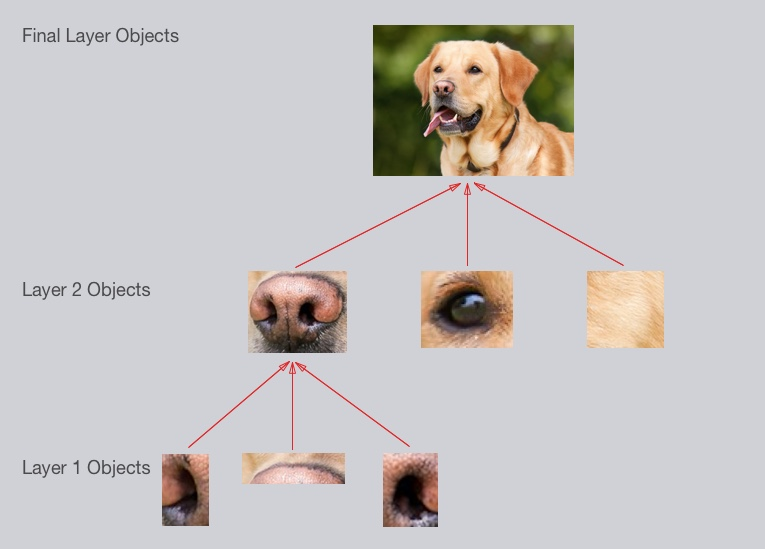

[](https://www.udacity.com/robotics)

## Deep Learning Project by Lee Seng##
In this project, i'll train a deep neural network to handle segmentation task. Image segmentation is about object classification at pixel level. We are running a drone in simulator to capture images to build up an network architect for training. The same network can be applied to train realistic images later. The project can be applied to scenarios like "follow me" drone camera as well as human-robot collabration in industry.


Objects detected at pixel level. Same object is displayed in same color. 

##Segmentation Deep neural network
Our Segmentation Deep neural network is Fully Convolutional Network. It basically consists of following 3 layers:
1. Encoding layer
2. 1x1 convolution layer
3. Decoding layer
4. Skipping connection


Object, .e.g, cars, are colored in purple. 

###1. Encoding layer
In Fully convolutional Network, Encoding layer simply consists of layers of convolutional network, which responsibles for identifying objects at various scale. 

A typical conolutional layers are constructed as below.


The inputs are usually images with widthxheightx3color(RGB). The images will be convoluted with kernel into 128x128x16 feature map. The feature map can be further convoluted into 64x64x64 feature map for next level of object shape detection.
These convolutional operations show result as following dog image detection. 



First layer typically detects simple shapes like line in dog nostril, whereas higher layer can detects complicated shapes like dog face, as depicted above.

The encoding layer can be implemented in Keras as following:

```python
from utils.separable_conv2d import SeparableConv2DKeras, BilinearUpSampling2D
from tensorflow.contrib.keras.python.keras import layers, models

def separable_conv2d_batchnorm(input_layer, filters, strides=1):
    output_layer = SeparableConv2DKeras(filters=filters,kernel_size=3, strides=strides,
                             padding='same', activation='relu')(input_layer)
    
    output_layer = layers.BatchNormalization()(output_layer) 
    return output_layer
    
def encoder_block(input_layer):
    encoding1 = separable_conv2d_batchnorm(input_layer=input_layer, filters=64, strides=2)
    encoding2 = separable_conv2d_batchnorm(input_layer=encoding1, filters=128, strides=2)
    encoding3 = separable_conv2d_batchnorm(input_layer=encoding2, filters=512, strides=2)
    return encoding3

```


###1x1 convolution layer
Typical Convolutional Network applied a Fully Connected layer for classification task. Fully Connected layer therefore convert 4D information into 2D for classification. For our application, we need spatial information, we needs 4D information to be preserved and 1x1 convolutional layer serves this purpose. 


The 1x1 convolution has following advantages:
1. 1x1 convolution layer is as cheap in computation as simple matrix multiplication.
2. Adding 1x1 convolution layer adding deepness to the network cheaply as per item1.
3. 1x1 convolution can also reduce dimensionality of previous layer while keeping spatial info.

We can implement 1x1 convolution layer as follwing code block:

```pythonstub
    con1x = conv2d_batchnorm(input_layer=encoding3, filters=2048, kernel_size=1, strides=1)

```

### Decoding layer
Decoding layer consists of transposed convolutional networks. Transposed convolutional network are just reversed operations of normal convolutional networks. Other than that, it also concatenated with same level of convolutional network. This network concatenation bypass deeper convolution/deconvolution operations and thus getting the name of Skip Connection.
Below shows Decoding layer with Skip Connection from Encoding layer.


Typically, decoding layer can be implemented as below:
```python
def decoder_block(small_ip_layer, large_ip_layer, filters):
    
    # TODO Upsample the small input layer using the bilinear_upsample() function.
    upscaled = bilinear_upsample(input_layer=small_ip_layer)
    
    # TODO Concatenate the upsampled and large input layers using layers.concatenate
    larger = layers.concatenate([upscaled, large_ip_layer])
    
    # TODO Add some number of separable convolution layers
    output_layer = separable_conv2d_batchnorm(input_layer=larger, filters=filters)
    
    return output_layer
    
    decoding_layer3=decoder_block(small_ip_layer=con1x, large_ip_layer=encoding_layer2, filters=512)
    decoding_layer2=decoder_block(small_ip_layer=decoding_layer3, large_ip_layer=encoding_layer1, filters=128)
    x=decoder_block(small_ip_layer=decoding_layer2, large_ip_layer=inputs, filters=64)

```

##Network Training
###Very Basic Fully Convolutional Network
For this project, the hyperparameters and Fully Convolutional network are initialized as following 
```python

def fcn_model(inputs, num_classes):
    
    # TODO Add Encoder Blocks. 
    encoding_layer1 = encoder_block(input_layer=inputs, filters=8, strides=2)

    # TODO Add 1x1 Convolution layer using conv2d_batchnorm().
    con1x = conv2d_batchnorm(input_layer=encoding_layer1, filters=8, kernel_size=1, strides=1)
    
    # TODO: Add the same number of Decoder Blocks as the number of Encoder Blocks
    x=decoder_block(small_ip_layer=con1x , large_ip_layer=inputs , filters=8)
    
    # The function returns the output layer of your model. "x" is the final layer obtained from the last decoder_block()
    return layers.Conv2D(num_classes, 1, activation='softmax', padding='same')(x)

learning_rate = 0.1
batch_size = 8
num_epochs = 10
steps_per_epoch = 200
validation_steps = 50
workers = 2
```
I prefer to use small batch_size and small num_epochs to try out various Network architecture. Batch_size will only be changed to maximum value which my GPU card can handle, only after network architecture is finalized.

I train the network with existing dataset as per instructed in [project setup](https://github.com/udacity/RoboND-DeepLearning-Project)
The GPU is nVidia GTX 1080 with 8GB video RAM.

First training results in training loss: 0.0569 - val_loss: 0.0711
Each training epoch takes about 13 second. A quick 3 minutes gives us a basic ground to tune. 
However, the validation loss is bouncing around drastically.


```markdown
epoch time: 13s - loss: 0.0569 - val_loss: 0.0711

# Scores for while the quad is following behind the target. 
number of validation samples intersection over the union evaulated on 542
average intersection over union for background is 0.977744405858438
average intersection over union for other people is 0.004292933741539692
average intersection over union for the hero is 0.15260972035120104
number true positives: 539, number false positives: 0, number false negatives: 0


# Scores for images while the quad is on patrol and the target is not visable
true_pos2, false_pos2, false_neg2, iou2 = scoring_utils.score_run_iou(val_no_targ, pred_no_targ)
number of validation samples intersection over the union evaulated on 270
average intersection over union for background is 0.956318123442222
average intersection over union for other people is 0.006631044975552111
average intersection over union for the hero is 0.0
number true positives: 0, number false positives: 87, number false negatives: 0

# This score measures how well the neural network can detect the target from far away
true_pos3, false_pos3, false_neg3, iou3 = scoring_utils.score_run_iou(val_with_targ, pred_with_targ)
number of validation samples intersection over the union evaulated on 322
average intersection over union for background is 0.9909437274637293
average intersection over union for other people is 0.006552324720294332
average intersection over union for the hero is 0.07879394895593467
number true positives: 137, number false positives: 4, number false negatives: 164

# Sum all the true positives, etc from the three datasets to get a weight for the score
true_pos = true_pos1 + true_pos2 + true_pos3
false_pos = false_pos1 + false_pos2 + false_pos3
false_neg = false_neg1 + false_neg2 + false_neg3
​
weight = true_pos/(true_pos+false_neg+false_pos)
print(weight)
0.7261009667024705

# The IoU for the dataset that never includes the hero is excluded from grading
final_IoU = (iou1 + iou3)/2
print(final_IoU)
0.115701834654

# And the final grade score is 
final_score = final_IoU * weight
print(final_score)
0.0840112139912
```

IoU for hero is bad. It's best result is only 0.15260972035120104, which leads to very poor final score of 0.0840112139912. We need to cross 0.40 to pass this project.

### Lower learning rate to 0.001
With bouncing validation loss curve in mind, I decided to lower the learning rate to 0.001.

The training curves look much smoother and trending down. I think the learning rate is pretty all right.

However, other IoU metrics still not good.
```markdown
epoch time: 13s - loss: 0.0681 - val_loss: 0.0722

# Scores for while the quad is following behind the target. 
true_pos1, false_pos1, false_neg1, iou1 = scoring_utils.score_run_iou(val_following, pred_following)
number of validation samples intersection over the union evaulated on 542
average intersection over union for background is 0.9794303508451028
average intersection over union for other people is 0.022882142478590082
average intersection over union for the hero is 0.16241187167269963
number true positives: 423, number false positives: 0, number false negatives: 116

# Scores for images while the quad is on patrol and the target is not visable
true_pos2, false_pos2, false_neg2, iou2 = scoring_utils.score_run_iou(val_no_targ, pred_no_targ)
number of validation samples intersection over the union evaulated on 270
average intersection over union for background is 0.957756909419221
average intersection over union for other people is 0.053466273544478735
average intersection over union for the hero is 0.0
number true positives: 0, number false positives: 83, number false negatives: 0

# This score measures how well the neural network can detect the target from far away
true_pos3, false_pos3, false_neg3, iou3 = scoring_utils.score_run_iou(val_with_targ, pred_with_targ)
number of validation samples intersection over the union evaulated on 322
average intersection over union for background is 0.9910897482238301
average intersection over union for other people is 0.055296310115268976
average intersection over union for the hero is 0.016490102015802133
number true positives: 60, number false positives: 1, number false negatives: 241

# Sum all the true positives, etc from the three datasets to get a weight for the score
true_pos = true_pos1 + true_pos2 + true_pos3
false_pos = false_pos1 + false_pos2 + false_pos3
false_neg = false_neg1 + false_neg2 + false_neg3
​
weight = true_pos/(true_pos+false_neg+false_pos)
print(weight)
0.5227272727272727

# The IoU for the dataset that never includes the hero is excluded from grading
final_IoU = (iou1 + iou3)/2
print(final_IoU)
0.0894509868443

# And the final grade score is 
final_score = final_IoU * weight
print(final_score)
0.0467584703959
```
IoU for hero still bad. It's best result is 0.16241187167269963, slightly better than previous 0.15260972035120104. Final score is 0.0467584703959
, which is 50% of previous score.

###Wider layer
I decided to wider the layers. I change encoding and decoding layer filters = 64. 
```python

def fcn_model(inputs, num_classes):
    
    # TODO Add Encoder Blocks. 
    encoding_layer1 = encoder_block(input_layer=inputs, filters=64, strides=2)

    # TODO Add 1x1 Convolution layer using conv2d_batchnorm().
    con1x = conv2d_batchnorm(input_layer=encoding_layer1, filters=8, kernel_size=1, strides=1)
    
    # TODO: Add the same number of Decoder Blocks as the number of Encoder Blocks
    x=decoder_block(small_ip_layer=con1x , large_ip_layer=inputs , filters=64)
    
    # The function returns the output layer of your model. "x" is the final layer obtained from the last decoder_block()
    return layers.Conv2D(num_classes, 1, activation='softmax', padding='same')(x)

learning_rate = 0.001
batch_size = 8
num_epochs = 10
steps_per_epoch = 200
validation_steps = 50
workers = 2
```

As layers become wider, 
Each epoch training increased to 17seconds, which is extra 4 seconds. The ending training loss and validation loss is about the same, but the training loss and validation loss drop significantly during first 3 epochs.


previous model depicted below for easy comparion.


```markdown
epoch time: 17s - loss: 0.0600 - val_loss: 0.0760

# Scores for while the quad is following behind the target. 
true_pos1, false_pos1, false_neg1, iou1 = scoring_utils.score_run_iou(val_following, pred_following)
number of validation samples intersection over the union evaulated on 542
average intersection over union for background is 0.9801469864140444
average intersection over union for other people is 0.055835461952097334
average intersection over union for the hero is 0.23979109380079927
number true positives: 528, number false positives: 0, number false negatives: 11

# Scores for images while the quad is on patrol and the target is not visable
true_pos2, false_pos2, false_neg2, iou2 = scoring_utils.score_run_iou(val_no_targ, pred_no_targ)
number of validation samples intersection over the union evaulated on 270
average intersection over union for background is 0.9594681698511748
average intersection over union for other people is 0.1253691469013104
average intersection over union for the hero is 0.0
number true positives: 0, number false positives: 41, number false negatives: 0

# This score measures how well the neural network can detect the target from far away
true_pos3, false_pos3, false_neg3, iou3 = scoring_utils.score_run_iou(val_with_targ, pred_with_targ)
number of validation samples intersection over the union evaulated on 322
average intersection over union for background is 0.991131395019559
average intersection over union for other people is 0.10644469957997826
average intersection over union for the hero is 0.025915759066637224
number true positives: 57, number false positives: 1, number false negatives: 244

# Sum all the true positives, etc from the three datasets to get a weight for the score
true_pos = true_pos1 + true_pos2 + true_pos3
false_pos = false_pos1 + false_pos2 + false_pos3
false_neg = false_neg1 + false_neg2 + false_neg3
​
weight = true_pos/(true_pos+false_neg+false_pos)
print(weight)
0.6632653061224489

# The IoU for the dataset that never includes the hero is excluded from grading
final_IoU = (iou1 + iou3)/2
print(final_IoU)
0.132853426434

# And the final grade score is 
final_score = final_IoU * weight
print(final_score)
0.088117068553
```
The Best IoU for hero is 0.23979109380079927, which is 7% better.

### How about Deeper Encoding and Decoding layers?
I decided add 2 more layers to have deeper Encoding and Decoding layer. 

```python
def fcn_model(inputs, num_classes):
    
    # TODO Add Encoder Blocks. 
    # Remember that with each encoder layer, the depth of your model (the number of filters) increases.

    encoding_layer1 = encoder_block(input_layer=inputs, filters=64, strides=2)
    encoding_layer2 = encoder_block(input_layer=encoding_layer1, filters=128, strides=2)
    encoding_layer3 = encoder_block(input_layer=encoding_layer2, filters=512, strides=2)

    # TODO Add 1x1 Convolution layer using conv2d_batchnorm().
    con1x = conv2d_batchnorm(input_layer=encoding_layer3, filters=8, kernel_size=1, strides=1)
    
    # TODO: Add the same number of Decoder Blocks as the number of Encoder Blocks

    decoding_layer3=decoder_block(small_ip_layer=con1x, large_ip_layer=encoding_layer2, filters=512)
    decoding_layer2=decoder_block(small_ip_layer=decoding_layer3, large_ip_layer=encoding_layer1, filters=128)
    x=decoder_block(small_ip_layer=decoding_layer2, large_ip_layer=inputs, filters=64)

    
    # The function returns the output layer of your model. "x" is the final layer obtained from the last decoder_block()
    return layers.Conv2D(num_classes, 1, activation='softmax', padding='same')(x)
    
learning_rate = 0.001
batch_size = 8
num_epochs = 10
steps_per_epoch = 200
validation_steps = 50
workers = 2
    
```
The result is amazing! The epoch time increased to 35 seconds, almost double the time spent. However, the losses decreased 50% to loss: 0.0287 - val_loss: 0.0325


```markdown
35s - loss: 0.0287 - val_loss: 0.0325

# Scores for while the quad is following behind the target. 
true_pos1, false_pos1, false_neg1, iou1 = scoring_utils.score_run_iou(val_following, pred_following)
number of validation samples intersection over the union evaulated on 542
average intersection over union for background is 0.9934566658540932
average intersection over union for other people is 0.24185249653930205
average intersection over union for the hero is 0.8045715042083385
number true positives: 539, number false positives: 0, number false negatives: 0

# Scores for images while the quad is on patrol and the target is not visable
true_pos2, false_pos2, false_neg2, iou2 = scoring_utils.score_run_iou(val_no_targ, pred_no_targ)
number of validation samples intersection over the union evaulated on 270
average intersection over union for background is 0.9784567934277614
average intersection over union for other people is 0.551442624466363
average intersection over union for the hero is 0.0
number true positives: 0, number false positives: 47, number false negatives: 0

# This score measures how well the neural network can detect the target from far away
true_pos3, false_pos3, false_neg3, iou3 = scoring_utils.score_run_iou(val_with_targ, pred_with_targ)
number of validation samples intersection over the union evaulated on 322
average intersection over union for background is 0.9950794691781883
average intersection over union for other people is 0.32990358434689177
average intersection over union for the hero is 0.09246268781988813
number true positives: 81, number false positives: 1, number false negatives: 220

# Sum all the true positives, etc from the three datasets to get a weight for the score
true_pos = true_pos1 + true_pos2 + true_pos3
false_pos = false_pos1 + false_pos2 + false_pos3
false_neg = false_neg1 + false_neg2 + false_neg3
​
weight = true_pos/(true_pos+false_neg+false_pos)
print(weight)
0.6981981981981982

# The IoU for the dataset that never includes the hero is excluded from grading
final_IoU = (iou1 + iou3)/2
print(final_IoU)
0.448517096014

# And the final grade score is 
final_score = final_IoU * weight
print(final_score)
0.313153828298

```
The Best IoU for hero is 0.8045715042083385, which is 255.5% improvement from previous  0.23979109380079927.
The IoU for hero on far away detection is 0.09246268781988813, which is 256.8% better than previous 0.025915759066637224
The final score also enjoy similar improvement of 255.4%. Scored 0.313153828298 from 0.088117068553 peviously.

This is pretty much testimony the rise of Deep Learning.


###Wider 1x1 convolution helps?
With previous impressive improvement, I also want to try out wider 1x1 convolution. I change the filters= 1024

```python
def fcn_model(inputs, num_classes):
    
    # TODO Add Encoder Blocks. 
    # Remember that with each encoder layer, the depth of your model (the number of filters) increases.

    encoding_layer1 = encoder_block(input_layer=inputs, filters=64, strides=2)
    encoding_layer2 = encoder_block(input_layer=encoding_layer1, filters=128, strides=2)
    encoding_layer3 = encoder_block(input_layer=encoding_layer2, filters=512, strides=2)

    # TODO Add 1x1 Convolution layer using conv2d_batchnorm().
    con1x = conv2d_batchnorm(input_layer=encoding_layer3, filters=1024, kernel_size=1, strides=1)
    
    # TODO: Add the same number of Decoder Blocks as the number of Encoder Blocks

    decoding_layer3=decoder_block(small_ip_layer=con1x, large_ip_layer=encoding_layer2, filters=512)
    decoding_layer2=decoder_block(small_ip_layer=decoding_layer3, large_ip_layer=encoding_layer1, filters=128)
    x=decoder_block(small_ip_layer=decoding_layer2, large_ip_layer=inputs, filters=64)

    
    # The function returns the output layer of your model. "x" is the final layer obtained from the last decoder_block()
    return layers.Conv2D(num_classes, 1, activation='softmax', padding='same')(x)
    
learning_rate = 0.001
batch_size = 8
num_epochs = 10
steps_per_epoch = 200
validation_steps = 50
workers = 2
    
```


```markdown
epoch time: 36s - loss: 0.0315 - val_loss: 0.0440

# Scores for while the quad is following behind the target. 
true_pos1, false_pos1, false_neg1, iou1 = scoring_utils.score_run_iou(val_following, pred_following)
number of validation samples intersection over the union evaulated on 542
average intersection over union for background is 0.990243716902728
average intersection over union for other people is 0.25814973797131135
average intersection over union for the hero is 0.862560113630525
number true positives: 539, number false positives: 0, number false negatives: 0

# Scores for images while the quad is on patrol and the target is not visable
true_pos2, false_pos2, false_neg2, iou2 = scoring_utils.score_run_iou(val_no_targ, pred_no_targ)
number of validation samples intersection over the union evaulated on 270
average intersection over union for background is 0.9815292681690468
average intersection over union for other people is 0.6658398308569334
average intersection over union for the hero is 0.0
number true positives: 0, number false positives: 63, number false negatives: 0

# This score measures how well the neural network can detect the target from far away
true_pos3, false_pos3, false_neg3, iou3 = scoring_utils.score_run_iou(val_with_targ, pred_with_targ)
number of validation samples intersection over the union evaulated on 322
average intersection over union for background is 0.9925338349865733
average intersection over union for other people is 0.32865363674692
average intersection over union for the hero is 0.13380111678102963
number true positives: 92, number false positives: 1, number false negatives: 209

# Sum all the true positives, etc from the three datasets to get a weight for the score
true_pos = true_pos1 + true_pos2 + true_pos3
false_pos = false_pos1 + false_pos2 + false_pos3
false_neg = false_neg1 + false_neg2 + false_neg3
​
weight = true_pos/(true_pos+false_neg+false_pos)
print(weight)
0.6980088495575221

# The IoU for the dataset that never includes the hero is excluded from grading
final_IoU = (iou1 + iou3)/2
print(final_IoU)
0.498180615206

# And the final grade score is 
final_score = final_IoU * weight
print(final_score)
0.347734478092

```

The IoU for the hero about following behind is 0.862560113630525, while previous score is 0.8045715042083385
The IoU for the hero about detection from far away is 0.13380111678102963, while previous score is 0.09246268781988813
The final score is 0.347734478092, while 0.313153828298 previously.

All of these results showing around 10% improvement.

### How about deeper 1x1 convolution layer?
With impressive result from Deeper Encoding/Decoding layer, i decided to deepen 1x1 convolution layer.

```python
def fcn_model(inputs, num_classes):
    
    # TODO Add Encoder Blocks. 
    # Remember that with each encoder layer, the depth of your model (the number of filters) increases.

    encoding_layer1 = encoder_block(input_layer=inputs, filters=64, strides=2)
    encoding_layer2 = encoder_block(input_layer=encoding_layer1, filters=128, strides=2)
    encoding_layer3 = encoder_block(input_layer=encoding_layer2, filters=512, strides=2)

    # TODO Add 1x1 Convolution layer using conv2d_batchnorm().
    con1x = conv2d_batchnorm(input_layer=encoding_layer3, filters=1024, kernel_size=1, strides=1)
    con2x = conv2d_batchnorm(input_layer=con1x, filters=2048, kernel_size=1, strides=1)
    con3x = conv2d_batchnorm(input_layer=con2x, filters=4096, kernel_size=1, strides=1)
    
    # TODO: Add the same number of Decoder Blocks as the number of Encoder Blocks

    decoding_layer3=decoder_block(small_ip_layer=con3x, large_ip_layer=encoding_layer2, filters=512)
    decoding_layer2=decoder_block(small_ip_layer=decoding_layer3, large_ip_layer=encoding_layer1, filters=128)
    x=decoder_block(small_ip_layer=decoding_layer2, large_ip_layer=inputs, filters=64)

    
    # The function returns the output layer of your model. "x" is the final layer obtained from the last decoder_block()
    return layers.Conv2D(num_classes, 1, activation='softmax', padding='same')(x)
    
```


```markdown
Epoch time: 61s - loss: 0.0307 - val_loss: 0.0298

# Scores for while the quad is following behind the target. 
true_pos1, false_pos1, false_neg1, iou1 = scoring_utils.score_run_iou(val_following, pred_following)
number of validation samples intersection over the union evaulated on 542
average intersection over union for background is 0.992848235702542
average intersection over union for other people is 0.29030657760594986
average intersection over union for the hero is 0.8928946346302762
number true positives: 539, number false positives: 1, number false negatives: 0

# Scores for images while the quad is on patrol and the target is not visable
true_pos2, false_pos2, false_neg2, iou2 = scoring_utils.score_run_iou(val_no_targ, pred_no_targ)
number of validation samples intersection over the union evaulated on 270
average intersection over union for background is 0.9810655928369504
average intersection over union for other people is 0.6156803974550956
average intersection over union for the hero is 0.0
number true positives: 0, number false positives: 87, number false negatives: 0

# This score measures how well the neural network can detect the target from far away
true_pos3, false_pos3, false_neg3, iou3 = scoring_utils.score_run_iou(val_with_targ, pred_with_targ)
number of validation samples intersection over the union evaulated on 322
average intersection over union for background is 0.9953017777383949
average intersection over union for other people is 0.37215004102999294
average intersection over union for the hero is 0.14576112948346187
number true positives: 103, number false positives: 2, number false negatives: 198

# Sum all the true positives, etc from the three datasets to get a weight for the score
true_pos = true_pos1 + true_pos2 + true_pos3
false_pos = false_pos1 + false_pos2 + false_pos3
false_neg = false_neg1 + false_neg2 + false_neg3
​
weight = true_pos/(true_pos+false_neg+false_pos)
print(weight)
0.6903225806451613

# The IoU for the dataset that never includes the hero is excluded from grading
final_IoU = (iou1 + iou3)/2
print(final_IoU)
0.519327882057

# And the final grade score is 
final_score = final_IoU * weight
print(final_score)
0.358503763742
```

61s - loss: 0.0307 - val_loss: 0.0298
epoch time: 36s - loss: 0.0315 - val_loss: 0.0440


The IoU for the hero about following behind is 0.8928946346302762, while previous score is 0.862560113630525
The IoU for the hero about detection from far away is 0.14576112948346187, while previous score is 0.13380111678102963
The final score is 0.358503763742, while 0.347734478092 previously.

All of these showing around 3-5% improvement, but with the cost of double workload! We may want to drop this change, at least for the quick evaluation stage.

From the score of IoU for the hero about detection from far away, I think the is not enough data about that. I believe it is time to collect my own data from Drone simulator.

### Additional Data Collection
Before I start to collect images from Drone Simulator, I review images from sample_evaluation_data/patrol_with_targ folder.
[!sampleEvaluation](docs/misc/2_run2cam1_00296.jpeg)
The image above tells us following information:
1. The default drone height may not be optimized. The picture shows big marble on the floor.
2. The drone flight slightly above typical human height. 
3. Where is the place with marble and trees.

[!sample2Evaluation](docs/misc/2_run2cam1_00301.jpeg)
This image tells us that the activity range is within 3 parallel streets.

With these info, i have a few runs of simulation. After running code/preprocess_ims.py, I have another 7000 plus images for training.
The training network is without 1x1 convolution layer for better quick evaluation.

```python
def fcn_model(inputs, num_classes):
    
    # TODO Add Encoder Blocks. 
    # Remember that with each encoder layer, the depth of your model (the number of filters) increases.

    encoding_layer1 = encoder_block(input_layer=inputs, filters=64, strides=2)
    encoding_layer2 = encoder_block(input_layer=encoding_layer1, filters=128, strides=2)
    encoding_layer3 = encoder_block(input_layer=encoding_layer2, filters=512, strides=2)

    # TODO Add 1x1 Convolution layer using conv2d_batchnorm().
    con1x = conv2d_batchnorm(input_layer=encoding_layer3, filters=1024, kernel_size=1, strides=1)
    
    # TODO: Add the same number of Decoder Blocks as the number of Encoder Blocks

    decoding_layer3=decoder_block(small_ip_layer=con1x, large_ip_layer=encoding_layer2, filters=512)
    decoding_layer2=decoder_block(small_ip_layer=decoding_layer3, large_ip_layer=encoding_layer1, filters=128)
    x=decoder_block(small_ip_layer=decoding_layer2, large_ip_layer=inputs, filters=64)

    
    # The function returns the output layer of your model. "x" is the final layer obtained from the last decoder_block()
    return layers.Conv2D(num_classes, 1, activation='softmax', padding='same')(x)
    
learning_rate = 0.001
batch_size = 8
num_epochs = 10
steps_per_epoch = 200
validation_steps = 50
workers = 2
    
```

[!MoreData](docs/misc/moreData.png)

```markdown
Epoch time:37s - loss: 0.0220 - val_loss: 0.0507

# Scores for while the quad is following behind the target. 
true_pos1, false_pos1, false_neg1, iou1 = scoring_utils.score_run_iou(val_following, pred_following)
number of validation samples intersection over the union evaulated on 542
average intersection over union for background is 0.9935651744496008
average intersection over union for other people is 0.2525243989787737
average intersection over union for the hero is 0.8590097749649536
number true positives: 539, number false positives: 0, number false negatives: 0

# Scores for images while the quad is on patrol and the target is not visable
true_pos2, false_pos2, false_neg2, iou2 = scoring_utils.score_run_iou(val_no_targ, pred_no_targ)
number of validation samples intersection over the union evaulated on 270
average intersection over union for background is 0.9805328641534856
average intersection over union for other people is 0.5951317551539856
average intersection over union for the hero is 0.0
number true positives: 0, number false positives: 45, number false negatives: 0

# This score measures how well the neural network can detect the target from far away
true_pos3, false_pos3, false_neg3, iou3 = scoring_utils.score_run_iou(val_with_targ, pred_with_targ)
number of validation samples intersection over the union evaulated on 322
average intersection over union for background is 0.9956563302653487
average intersection over union for other people is 0.3742632750798337
average intersection over union for the hero is 0.2212737292960813
number true positives: 131, number false positives: 1, number false negatives: 170

# Sum all the true positives, etc from the three datasets to get a weight for the score
true_pos = true_pos1 + true_pos2 + true_pos3
false_pos = false_pos1 + false_pos2 + false_pos3
false_neg = false_neg1 + false_neg2 + false_neg3
​
weight = true_pos/(true_pos+false_neg+false_pos)
print(weight)
0.7562076749435666

# The IoU for the dataset that never includes the hero is excluded from grading
final_IoU = (iou1 + iou3)/2
print(final_IoU)
0.540141752131

# And the final grade score is 
final_score = final_IoU * weight
print(final_score)
0.408459338519

```

The IoU for the hero about following behind is 0.8590097749649536, while previous score is 0.862560113630525
The IoU for the hero about detection from far away is 0.2212737292960813, while previous score is 0.13380111678102963
The final score is 0.408459338519, while 0.347734478092 previously.

IoU for hero on detection from far away has been improved significantly. It is 65.37% improvement.

We barely passed the final score during quick evaluation.

The models can be downloaded as [model](data/weights/model_weights-vl0.0507313845679-b8-e10) and [modelConfig](data/weights/config_model_weights-vl0.0507313845679-b8-e10)

The jupyter notebook can be refer at [modelSimple](code/model_training-simple.ipynb)

The result of notebook execution can be refer at [result](docs/model_training-simple-0.40.html)


##What is Next?
We had witness why Deep Learning works well when we deepen Encoding/Decoding layers.
we may want to try Deeper networks, more epochs and bigger batch size, as well as collecting more relevant hero images from far.
The images are masked in blue color for hero, and in green color for other human. Background are masked in red. Therefore, the training are focus on classifying these 3 classes. Other objects, like tree, will be considered as background and therefore the classification result is not as useful as human or hero.


